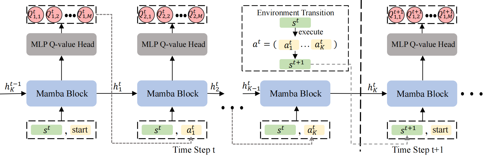

# Q-Mamba

Code of paper: Meta-Black-Box-Optimization through Offline Q-function Learning.




## Preparations

### Create and activate conda environment
First, create the q_mamba environment.
```bash
conda create --name q_mamba python=3.10
conda activate q_mamba
```
Then install Pytorch with version 1.12+ and CUDA 11.6+ (see https://pytorch.org/ for more details). The cuda-toolkit is also required ``conda install nvidia::cuda-toolkit=12.1``.

Next, install the mamba-ssm using ``pip install mamba-ssm`` (see https://github.com/state-spaces/mamba.git for more details).

Finally, install the other necessary libraries.
```bash
pip install -r requirements.txt
```

Other requirements:
- Linux
- NVIDIA GPU
- PyTorch 1.12+
- CUDA 11.6+


### Train
To quickly start training, 
firstly, download the training trajectories from [here](https://github.com/GMC-DRL/Q-Mamba/tree/main). The directory could be set like this basic structure:
```bash
├── /trajectory_files/
│  ├── trajectory_set_0_Rand.pkl
│  ├── trajectory_set_0_CfgX.pkl  
│  ├── trajectory_set_0_Unit.pkl   
│  ├── trajectory_set_1_Unit.pkl   
│  ├── trajectory_set_2_Unit.pkl                     
```
Then we can train the main Q-Mamba agent using:

```bash
# train q_mamba with conservative_reg_loss 
python run.py --train --trajectory_file_path './trajectory_files/trajectory_set_0_Unit.pkl' --has_conservative_reg_loss 

# train q_mamba without conservative_reg_loss
python run.py --train --trajectory_file_path './trajectory_files/trajectory_set_0_Unit.pkl' 

```

Taking the training on _Alg0_ as an example, the models in the training is saved at ./model/trajectory_set_0_Unit/YYMMDDTHHmmSS/ (where YYMMDDTHHmmSS is the time stamp of the run) and the tensorboard log is stored at ./log/trajectory_set_0_Unit/YYMMDDTHHmmSS 

### Test
To test the trained model on the BBOB testing problems (Section 5.2, Table 1):
```bash
# test q_mamba 
python run.py --test --algorithm_id 0 --load_path [MODEL_PATH] 

```

For example, we have a pre-trained Q-Mamba model in ``./model/qmamba.pth``, which is trained with default settings in the paper on _Alg0_, its testing command is  
```bash
# test q_mamba 
python run.py --test --algorithm_id 0 --load_path ./model/qmamba.pth

```
